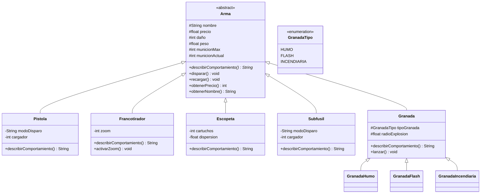

# crr-taller-git-2026

Taller de Git y Modelado Orientado a Objetos - Lenguajes de Programación 3 (CYT646) - 2026
API REST en Spring Boot 3 con dominio CS2.

## Diagrama de Clases (2 y 3 de septiembre)



## Criterios de Diseño y Enccapsulamiento

1. **Encapsulamiento e Invariantes:** El estado interno de las armas está protegido/privado.
Los constructores validan que el precio sea no negativo, el daño sea mayor a cero y los componentes específicos
(como el cargador o zoom) sean válidos, impidiendo estados inválidos desde el controller y otras clases.
2. **Método Abstracto:** La clase base `Arma` no puede implementar `describirComportamiento()`
porque un arma genérica no tiene mecánicas de disparo concretas; en CS2 una
pistola semiautomática se acciona de forma radicalmente distinta a un francotirador con mira telescópica.
3. **Polimorfismo:** El endpoint `/armas/comportamientos` manipula las instancias a través
del tipo padre `Arma`, invocando el método abstracto sin recurrir a bifurcaciones
condicionales (`if` o `instanceof`).

## Ejecución y Pruebas

```bash
./mvnw spring-boot:run
```

- **Inicio:** `GET http://localhost:8080/`
- **Construcción por URL:** `GET http://localhost:8080/armas/construir?nombre=AWP&precio=4750&dano=115&zoom=2`
- **Validación de error:** `GET http://localhost:8080/armas/construir?nombre=AWP&precio=-500` (Devuelve HTTP 400)
- **Polimorfismo:** `GET http://localhost:8080/armas/comportamientos`
