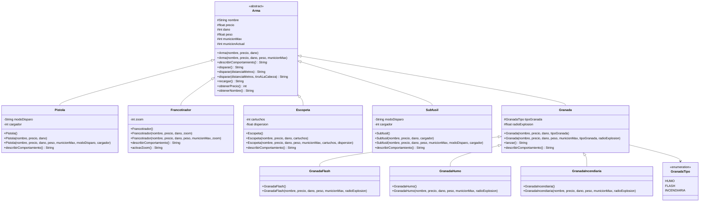

# crr-taller-git-2026

Repositorio del **Taller de Git y Modelado Orientado a Objetos** — Asignatura: **Lenguajes de Programación 3 (CYT646)** — Año 2026.  
Alumno: **César Ramírez Román** (`cesarraa`).  
Dominio seleccionado: **Counter-Strike 2 (CS2)**.  
Licencia: **Apache License 2.0** (ver archivo [LICENSE](LICENSE)).

---

## Enlace al Commit de la Solución

- **Commit de la entrega:** https://github.com/cesarraa/crr-taller-git-2026/commit/62066c81e70ff5432d503aabdc4122af595ff1e7

---

## 1. Organización de Paquetes

Siguiendo estrictamente las especificaciones del template de la cátedra ([lp3-template-tp](https://github.com/alefq/lp3-template-tp/tree/main/src/main/java/py/edu/uc/lp3)):

```text
src/main/java/py/edu/uc/lp3/
├── Cs2Application.java                     # Arranque de Spring Boot (@SpringBootApplication)
├── domain/                                 # Clases de dominio del modelo de CS2
│   ├── Arma.java                           # Clase base abstracta
│   ├── Francotirador.java                  # Especialización de Arma
│   ├── Pistola.java                        # Especialización de Arma
│   ├── Escopeta.java                       # Especialización de Arma
│   ├── Subfusil.java                       # Especialización de Arma
│   ├── Granada.java                        # Especialización de Arma
│   ├── GranadaFlash.java                   # Especialización de Granada
│   ├── GranadaHumo.java                    # Especialización de Granada
│   ├── GranadaIncendiaria.java             # Especialización de Granada
│   └── GranadaTipo.java                    # Enum de tipos de granada
└── rest/controller/                        # Capa de presentación REST (Servicios HTTP)
    ├── IndexController.java                # GET /
    └── ArmaController.java                 # GET /armas/construir, /armas/comportamientos, /armas/disparar
```

---

## 2. Diagrama de Clases (Mermaid)

El siguiente diagrama refleja fielmente la jerarquía de herencia, visibilidad de miembros, constructores y métodos implementados en `src/main/java/py/edu/uc/lp3/domain/`:


```mermaid
classDiagram
    class Arma {
        <<abstract>>
        #String nombre
        #float precio
        #int dano
        #float peso
        #int municionMax
        #int municionActual
        +Arma(nombre, precio, dano)
        +Arma(nombre, precio, dano, peso, municionMax)
        +describirComportamiento()* String
        +disparar() String
        +disparar(distanciaMetros) String
        +disparar(distanciaMetros, tiroALaCabeza) String
        +recargar() String
        +obtenerPrecio() int
        +obtenerNombre() String
    }

    class Pistola {
        -String modoDisparo
        -int cargador
        +Pistola()
        +Pistola(nombre, precio, dano)
        +Pistola(nombre, precio, dano, peso, municionMax, modoDisparo, cargador)
        +describirComportamiento() String
    }

    class Francotirador {
        -int zoom
        +Francotirador()
        +Francotirador(nombre, precio, dano, zoom)
        +Francotirador(nombre, precio, dano, peso, municionMax, zoom)
        +describirComportamiento() String
        +activarZoom() String
    }

    class Escopeta {
        -int cartuchos
        -float dispersion
        +Escopeta()
        +Escopeta(nombre, precio, dano, cartuchos)
        +Escopeta(nombre, precio, dano, peso, municionMax, cartuchos, dispersion)
        +describirComportamiento() String
    }

    class Subfusil {
        -String modoDisparo
        -int cargador
        +Subfusil()
        +Subfusil(nombre, precio, dano, cargador)
        +Subfusil(nombre, precio, dano, peso, municionMax, modoDisparo, cargador)
        +describirComportamiento() String
    }

    class Granada {
        #GranadaTipo tipoGranada
        #float radioExplosion
        +Granada(nombre, precio, dano, tipoGranada)
        +Granada(nombre, precio, dano, peso, municionMax, tipoGranada, radioExplosion)
        +lanzar() String
        +describirComportamiento() String
    }

    class GranadaFlash {
        +GranadaFlash()
        +GranadaFlash(nombre, precio, dano, peso, municionMax, radioExplosion)
    }

    class GranadaHumo {
        +GranadaHumo()
        +GranadaHumo(nombre, precio, dano, peso, municionMax, radioExplosion)
    }

    class GranadaIncendiaria {
        +GranadaIncendiaria()
        +GranadaIncendiaria(nombre, precio, dano, peso, municionMax, radioExplosion)
    }

    class GranadaTipo {
        <<enumeration>>
        HUMO
        FLASH
        INCENDIARIA
    }

    Arma <|-- Pistola
    Arma <|-- Francotirador
    Arma <|-- Escopeta
    Arma <|-- Subfusil
    Arma <|-- Granada
    Granada <|-- GranadaFlash
    Granada <|-- GranadaHumo
    Granada <|-- GranadaIncendiaria
    Granada --> GranadaTipo
```

---

## 3. Sobrecarga vs. Sobreescritura

En este ejercicio se aplicaron los dos mecanismos fundamentales del polimorfismo en la Programación Orientada a Objetos:

### ¿Qué cambió con la Sobrecarga (Overloading)?

La **sobrecarga** ocurre cuando existen múltiples métodos (o constructores) con el **mismo nombre pero diferente lista de parámetros** dentro de la misma clase o jerarquía. Se resuelve en **tiempo de compilación** (*polimorfismo estático*):

1. **Constructores sobrecargados:**
   - En la clase base `Arma`: se incorporó un constructor simple `Arma(nombre, precio, dano)` con valores estándar seguros (2.5 kg, 20 balas), junto al constructor completo sobrecargado `Arma(nombre, precio, dano, peso, municionMax)`.
   - En `Francotirador`: constructor por defecto `Francotirador()`, constructor simple `Francotirador(nombre, precio, dano, zoom)` y constructor sobrecargado completo `Francotirador(nombre, precio, dano, peso, municionMax, zoom)`.
   - En `Pistola`: constructor por defecto `Pistola()`, constructor simple `Pistola(nombre, precio, dano)` y constructor completo `Pistola(nombre, precio, dano, peso, municionMax, modoDisparo, cargador)`.
   - Cada constructor garantiza la invariante de estado: ningún constructor permite dejar el objeto en un estado inconsistente o con campos ilegales. Las subclases delegan la inicialización de atributos base mediante llamadas obligatorias a `super(...)`.
2. **Sobrecarga de mensajes del dominio (`disparar`):**
   - `disparar()`: Disparo simple a quemarropa sin argumentos adicionales.
   - `disparar(int distanciaMetros)`: Disparo especificando distancia, aplicando atenuación balística en el cálculo del daño efectivo.
   - `disparar(int distanciaMetros, boolean tiroALaCabeza)`: Disparo de alta precisión con cálculo de multiplicador crítico por *headshot*.

### ¿Qué cambió con la Sobreescritura (Overriding)?

La **sobreescritura** ocurre cuando una clase hija redefine un método de la clase padre manteniendo **exactamente la misma firma** (mismo nombre, mismos parámetros y tipo de retorno compatible). Se resuelve en **tiempo de ejecución** (*polimorfismo dinámico o enlace tardío*):

1. **Método abstracto en la clase base:**
   - La clase `Arma` declara: `public abstract String describirComportamiento();`
   - La clase padre no puede ni debe saber cómo opera cada familia de arma; esa responsabilidad pertenece a las clases concretas.
2. **Sobreescritura en clases hijas independientes:**
   - `Pistola` sobreescribe `@Override public String describirComportamiento()` informando su función como arma secundaria de combate cerrado, cadencia rápida y capacidad de su cargador.
   - `Francotirador` sobreescribe `@Override public String describirComportamiento()` detallando su rol quirúrgico a larga distancia con magnificación de mira óptica xZoom y penalización de dispersión sin apuntar.
3. **Consumo polimórfico en el Controller:**
   - En `ArmaController.listarComportamientos()` se almacena una colección `List<Arma>` que contiene tanto instancias de `Pistola` como de `Francotirador`.
   - El controlador interactúa con todas las instancias exclusivamente a través del tipo base `Arma` e invoca `arma.describirComportamiento()` sin requerir condicionales (`if/else`) ni inspección de tipos (`instanceof`).

### Comparación Conceptual

| Criterio | Sobrecarga (Overloading) | Sobreescritura (Overriding) |
|---|---|---|
| **Definición** | Mismo nombre de método con distinta firma (parámetros) | Misma firma exacta redefinida en una subclase |
| **Ubicación** | En la misma clase o heredada | En una clase hija (relación de herencia) |
| **Momento de resolución** | Tiempo de compilación (*enlace temprano*) | Tiempo de ejecución (*enlace tardío / dynamic dispatch*) |
| **Palabra clave / Anotación** | Ninguna obligatoria | `@Override` |
| **Ejemplo en el proyecto** | `disparar()` vs `disparar(distancia)` / Constructores | `describirComportamiento()` en `Francotirador` y `Pistola` |

---

## 4. Ocultamiento de la Información e Invariantes

> **Pregunta de anclaje de la rúbrica:** *¿Qué ocurre si el controller asigna a mano la vida o la munición? ¿Puede otra clase dejar el objeto en un estado imposible?*

- **Respuesta:** No, es imposible. Los atributos de las clases son `protected` y `private`.
- No existen setters públicos que permitan alterar libremente `municionActual`.
- La munición solo puede alterarse a través de los mensajes del dominio: `disparar()` (que decrementa la munición validando que sea mayor a cero) y `recargar()` (que restaura el cargador hasta el tope máximo).
- Todos los constructores y setters restantes validan sus invariantes (lanzando `IllegalArgumentException` si precio < 0, daño ≤ 0, zoom ≤ 0, etc.).

---

## 5. Instrucciones de Ejecución y Pruebas

### Arrancar el Microservicio

```bash
./mvnw spring-boot:run
```

El servicio iniciará en el puerto local `8080`.

### Probar los Servicios REST

#### 1. Confirmar estado del servicio (`GET /`)
```bash
curl -i http://localhost:8080/
```
Respuesta esperada (HTTP 200):
```json
{
  "status": "UP",
  "servicio": "Microservicio Spring Boot - Taller Git y POO",
  "autor": "César Ramírez Román",
  "asignatura": "Lenguajes de Programación 3 (CYT646)",
  "dominio": "Counter-Strike 2 (CS2)",
  "paquetes": "py.edu.uc.lp3.domain / py.edu.uc.lp3.rest.controller",
  "mecanismosPOO": "Sobrecarga (constructores y disparar) y Sobreescritura (describirComportamiento)"
}
```

#### 2. Construcción con Constructor Simple desde URL
```bash
curl -i "http://localhost:8080/armas/construir?tipo=francotirador&nombre=AWP&precio=4750&dano=115&zoom=2"
```

#### 3. Construcción con Constructor Sobrecargado desde URL
```bash
curl -i "http://localhost:8080/armas/construir?tipo=francotirador&nombre=AWP&precio=4750&dano=115&peso=4.3&municionMax=10&zoom=2"
```

#### 4. Rechazo de Invariante Violada (HTTP 400 Bad Request)
```bash
curl -i "http://localhost:8080/armas/construir?tipo=francotirador&nombre=AWP&precio=-100&dano=115"
```
Respuesta esperada:
```json
{
  "status": "RECHAZADO",
  "error": "Regla de invariante rota: el dominio rechazó la construcción.",
  "detalle": "El precio no puede ser negativo."
}
```

#### 5. Listado Polimórfico de Comportamientos Sobreescritos
```bash
curl -i http://localhost:8080/armas/comportamientos
```
Respuesta esperada:
```json
[
  {
    "tipoClaseHija": "Pistola",
    "nombre": "Desert Eagle",
    "precio": 700,
    "comportamiento": "Pistola Desert Eagle: arma secundaria para combate a corta distancia en modo Semiautomático con ciclo rápido de recarga para 7 balas."
  },
  {
    "tipoClaseHija": "Francotirador",
    "nombre": "AWP",
    "precio": 4750,
    "comportamiento": "Francotirador AWP: disparo quirúrgico letal a larga distancia utilizando mira telescópica con zoom óptico x2 y penalización severa de precisión al disparar sin fijar mira."
  }
]
```

#### 6. Prueba de Sobrecarga del Mensaje `disparar`
- Disparo simple: `curl "http://localhost:8080/armas/disparar"`
- Disparo a distancia: `curl "http://localhost:8080/armas/disparar?distancia=60"`
- Disparo a la cabeza: `curl "http://localhost:8080/armas/disparar?distancia=60&headshot=true"`

### Ejecutar Pruebas Automatizadas
```bash
./mvnw test
```
